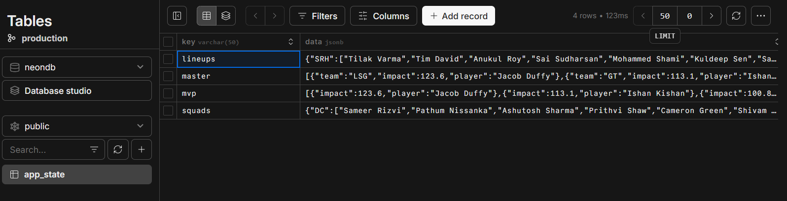
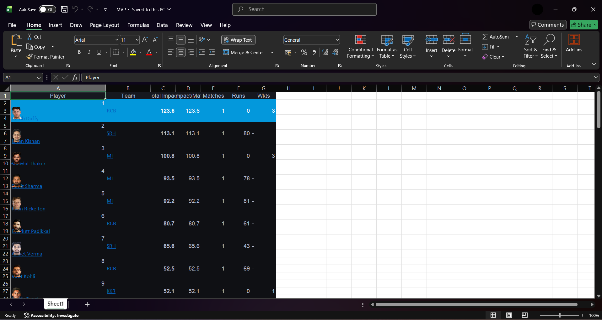
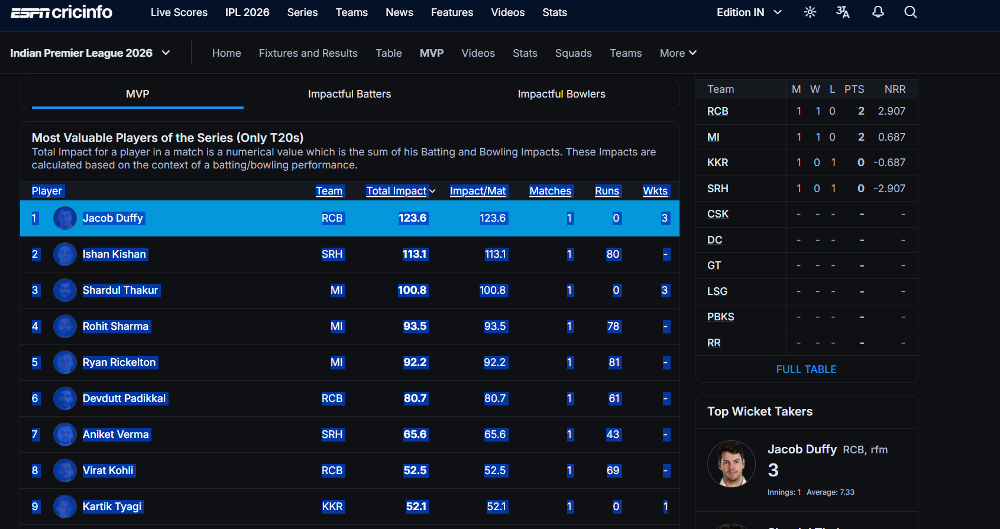

# 🏏 IPL 2026 Fantasy Dashboard

A high-performance, visually stunning companion for your IPL 2026 Mock Auction and Fantasy League. Built with **Streamlit** and optimized for both local use and long-term cloud deployment.

---

## 🚀 Quick Start: How to Fork & Deploy

1.  **Fork the Repo**: Click the "Fork" button at the top of this repository to create your own copy.
2.  **Clone Locally**: 
    ```bash
    git clone https://github.com/YOUR_USERNAME/ipl2026mockauction.git
    cd ipl2026mockauction
    ```
3.  **Install Dependencies**:
    ```bash
    pip install -r requirements.txt
    ```
4.  **Run the App**:
    ```bash
    streamlit run app.py
    ```

---

## 💎 Choosing Your Storage Mode

This app supports two modes of operation. Choose the one that fits your event duration.

### **Mode A: Local JSON (GitHub Default)**
*   **Best for**: 1-day sessions or running off your own laptop.
*   **How it works**: Data is saved into `squads.json` and `lineups.json` on your hard drive.
*   **⚠️ The Catch**: If you deploy to **Streamlit Community Cloud**, their servers "reset" every few days. Any changes you make via the website (like moving players) will be **wiped out** when the server reboots unless you manually copy-paste the JSON back to GitHub.

### **Mode B: Neon PostgreSQL (Professional/Persistent)**
*   **Best for**: Long-running leagues where data **must never be lost**.
*   **How it works**: The app uses a Serverless Postgres database to store every edit permanently.
*   **✅ The Win**: Even if the Streamlit server reboots 100 times, your lineups and squads will be exactly where you left them.

> [!IMPORTANT]
> **To enable persistence:** Create a free project at [neon.tech](https://neon.tech/), copy your connection string, and add it to your secrets file as `neon_url = "your-link-here"`.

---

## 🛡️ Security & Settings

All administrative tabs are protected by an `admin_password`. To configure your app:

1.  Create a folder named `.streamlit` in your project root.
2.  Create a file named `secrets.toml` inside it.
3.  Add the following:
    ```toml
    admin_password = "your_secure_password"
    neon_url = "optional_link_for_persistence"
    ```

---

## 🕹️ Feature Guide (Tabs)

| Tab | Purpose |
| :--- | :--- |
| **🏆 Leaderboard** | The main standings. Shows team ranks based on the impact points of their *entire* 25-man squad. |
| **🏃 Players** | A searchable directory of all players in the auction, sorted by impact score. |
| **🏘️ Teams** | Deep dive into individual rosters. See who bought whom and their total squad value. |
| **⭐ Playing XIs** | **[ADMIN]** Where you select the 11, 12, or 13 players who will actually play. Includes a real-time point calculator. |
| **📋 XI Leaderboard** | A specialized leaderboard that *only* counts points for the players in the active Playing XI. |
| **🚫 Unsold** | Keep track of remaining talent in the auction pool. |
| **🔄 Update Data** | **[ADMIN]** Upload a new `MVP.xlsx` file. The app will automatically redistribute points to the correct teams and update the JSON/Database instantly. |
| **👥 Edit Squads** | **[ADMIN]** A direct JSON editor to move players between teams or fix manual entry errors. |

---

## 🛠️ Data Management Workflow

1.  **Mock Auction**: Use the **Edit Squads** tab to add players to teams as they are sold. 
2.  **Live Updates**: As the IPL season progresses, update the stats by creating a new `MVP.xlsx` file and uploading it to the **Update Data** tab.
    *   Find an MVP or fantasy points table (e.g., ESPNCricinfo) and copy the table data.
    
    *   Paste it into an empty Excel file, ensuring it has at least the **Player** and **Total Impact** columns.
    
    *   Save it as `MVP.xlsx` and upload it to the dashboard.
    

3.  **Persistence Sync**: 
    - **Neon Mode**: The app automatically handles saving every change to your cloud database. To keep your GitHub repository in sync, you can occasionally download the JSON from the dashboard (using the new 📥 Download buttons) and replace your local `squads.json`, `lineups.json`, `master.json`, and `mvp.json` files.
    - **GitHub Only Mode**: Since the Streamlit server resets periodically, you MUST manually download the JSON files from the dashboard and push them back into your GitHub repository to prevent data loss.

---

**Built with ❤️ for the IPL Fans**
